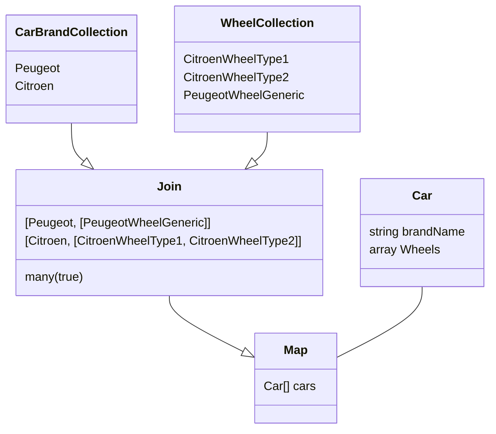

# Collection
Just another collection library, powered by generators, using static analysis, generics, easily extendable and immutable. **Lazy** by design and memory friendly.

# Requirement
To use this library you need at least php 8.0

# Usage

You first need to create the collection from an iterable, it can be an array, or anything that is iterable (generators, objects iterators, etc)

```PHP
$collection = Collection::from($myIterable);
```

Now you can apply one or multiple Modifier to it :

```PHP
use BenConda\Collection\Modifier as Op;
// [...]

$collection = Collection::from(range(1, 10))
->apply(
  new Op\Filter(
    callback: fn(int $item): bool => $item > 5
  ),
)->apply(
  new Op\Map(
    callback: fn(int $item): string => "The number is $item"
  )
);
```
Each time you call `apply()` it return a new instance of the collection, nothing is override.

The collection is invokable, so you can add modifiers like this too : 
```PHP
$collection = Collection::from(range(1, 10))
(
  new Op\Filter(
    callback: fn(int $item): bool => $item >= 5
  ),
)
(
  new Op\Map(
    callback: fn(int $item): string => "The number is $item"
  )
);
```
Because each modifier rely on generators, nothing is done until you start to iterate on the collection.


You can get the first value like this :
```PHP
$first = $collection->first(); // $first = The number is 5
```
Note that it won't go through the whole array to return the first value, 
behind the scene it only iterate through 1,2,3,4,5 => `The number is 5` and stop.

This is possible thanks to generators, most other Collection libraries will need to loop through 
the whole array to filter it, then Map every filtered value before you can get the first value.

We can iterate on all value using a foreach directly on the collection $object :
```PHP
$collection = Collection::from(range(1, 10))
foreach ($collection as $key => $item)
{
  // do what you want
}
```
And you can translate the whole Collection into an array like this : 
```PHP
iterator_to_array($collection);
```
Be careful, by design we accept anything as a key, array restrict keys to `int|string` type, so it can fail depending on your Collection TKey.
To overcome this, you can use the `Reindex` modifier, this modifier will reindex the iterator so the keys will be array compatible.
Note that in case of assoc array you will lose all the keys.

# Modifiers

Collection iteration will be altered using modifiers, which allow you to shape and transform data in a memory friendly way.

Some modifiers require some memory buffering, and are split in another namespace called BufferModifier. This is the case for example with `BenConda\Collection\BufferModifier\Reverse`, in order to reverse, the whole collection need to be loaded in memory.

So keep in mind, BufferModifier namespace = will consume memory depending on the size of the iterable.

## Join
This modifier allow you to join a Collection with another Collection, using a match callback.

You can see that like a SQL join but with 2 Collections.

The resulted Collection items are arrays containing the matched items, that you can then Map to create a new Class from it :



### Usage

```PHP
$carBrandCollection(
    new Join(
        collection: $wheelCollection,
        on: fn(CarBrand $carBrand, Wheel $wheel) => $wheel->getBrandId()->equals($carBrand->getId()),
        many: true // A car have multiple wheels
    )
)
(
    new Map(
        callback: fn(array $item) => new Car(...$item)
    )
)
```

Note : documentation is in progress and will be split in another page.
# Extend

## Add custom modifier
Simply create a class that implement `BenConda\Collection\Modifier\ModifierInterface`

For example, for the reindex modifier :

```PHP
use Generator;
use BenConda\Collection\Modifier\ModifierInterface;

/**
 * @template TKey
 * @template TValue
 *
 * @implements ModifierInterface<TKey, TValue>
 */
final class Reindex implements ModifierInterface
{
    /**
     *
     * @param iterable<TKey, TValue> $iterable
     *
     * @return Generator<int, TValue>
     */
    public function __invoke(iterable $iterable): Generator
    {
        foreach ($iterable as $value) {
            yield $value;
        }
    }
}
```

If you need some configuration, simply add a constructor to the class.

## Debug

There is a special Debug modifier, you can check [this test](tests/unit/CollectionTest.php#L64) to look how it works.